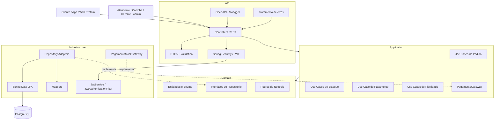

# Diagrama de Arquitetura


```mermaid
flowchart TB

    CLIENT["Cliente / App / Web / Totem"]
    STAFF["Atendente / Cozinha / Gerente / Admin"]

    subgraph API["API"]
        direction LR
        CTRL["Controllers REST"]
        DTO["DTOs + Validation"]
        SEC["Spring Security / JWT"]
        ERR["Tratamento de erros"]
        DOC["OpenAPI / Swagger"]
    end

    subgraph APP["Application"]
        direction LR
        UC_PED["Use Cases de Pedido"]
        UC_EST["Use Cases de Estoque"]
        UC_PAG["Use Case de Pagamento"]
        UC_FID["Use Cases de Fidelidade"]
        GATEWAY["PagamentoGateway"]
    end

    subgraph DOMAIN["Domain"]
        direction LR
        MODELS["Entidades e Enums"]
        REPOS["Interfaces de Repositório"]
        RULES["Regras de Negócio"]
    end

    subgraph INFRA["Infrastructure"]
        direction LR
        ADAPTERS["Repository Adapters"]
        JPA["Spring Data JPA"]
        MAPPERS["Mappers"]
        JWT["JwtService / JwtAuthenticationFilter"]
        MOCK["PagamentoMockGateway"]
    end

    DB[(PostgreSQL)]

    CLIENT --> CTRL
    STAFF --> CTRL

    DOC --> CTRL
    ERR --> CTRL

    CTRL --> DTO
    CTRL --> SEC
    CTRL --> APP

    SEC --> JWT

    APP --> DOMAIN
    APP --> GATEWAY

    ADAPTERS -.->|implementa| REPOS
    MOCK -.->|implementa| GATEWAY

    ADAPTERS --> MAPPERS
    ADAPTERS --> JPA
    JPA --> DB

```

A ideia desse diagrama é mostrar uma dependência importante:

```text
API → Application → Domain
              ↑
Infrastructure implementa contratos externos

```